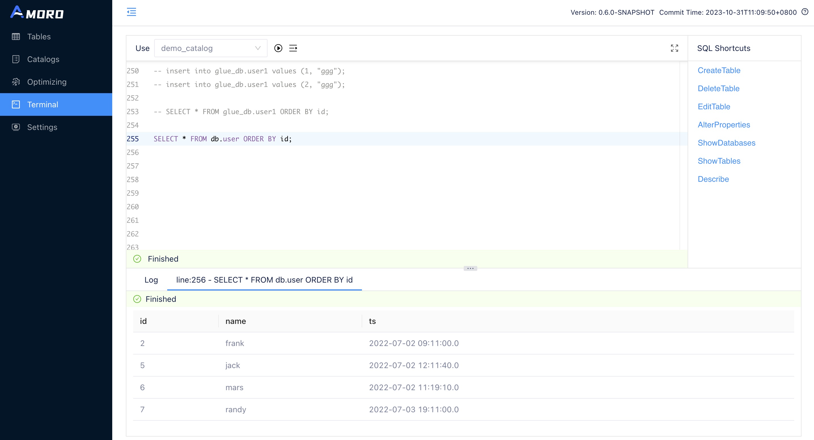

# Using Kyuubi By Terminal
**Prerequisites**:
- There must be a running Kyuubi. To deploy and run Kyuubi, please refer to [Kyuubi doc](https://kyuubi.readthedocs.io/en/master/)


Terminal supports interfacing with Kyuubi to submit SQL to Kyuubi for execution. All you need to do is add the Kyuubi configuration as instructed below:
```shell
ams:
    terminal:
      backend: kyuubi
      kyuubi.jdbc.url: jdbc:hive2://127.0.0.1:10009/ # kyuubi Connection Address
```

## Kerberos Authentication
If you need to authenticate the connection to Kyuubi using Kerberos information from the catalog, you need to add the 
configuration `kerberosAuthType=fromSubject` to the Kyuubi JDBC URL, for example:
```
jdbc:kyuubi://host:port/schema;kyuubiServerPrincipal=<serverPrincipal>;kerberosAuthType=fromSubject
```
Other Kerberos authentication configurations can be found in the official Kyuubi documentation (https://kyuubi.readthedocs.io/en/master/client/jdbc/kyuubi_jdbc.html?highlight=Kerberos#kerberos-authentication).

Without configuring Kyuubi, Terminal executes in memory in AMS.

To execute SQL in Terminal, you can refer to the following steps:：

- Please switch Catalog first
- Before writing SQL, you can use the provided SQL Shortcuts function to help you build SQL quickly.
- Writing SQL
- Click the Execute button to run the SQL;


