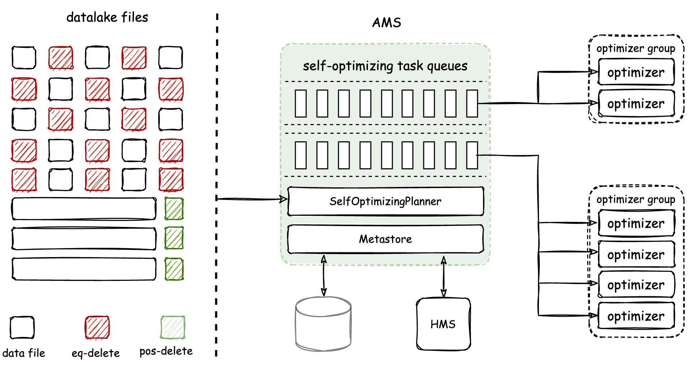
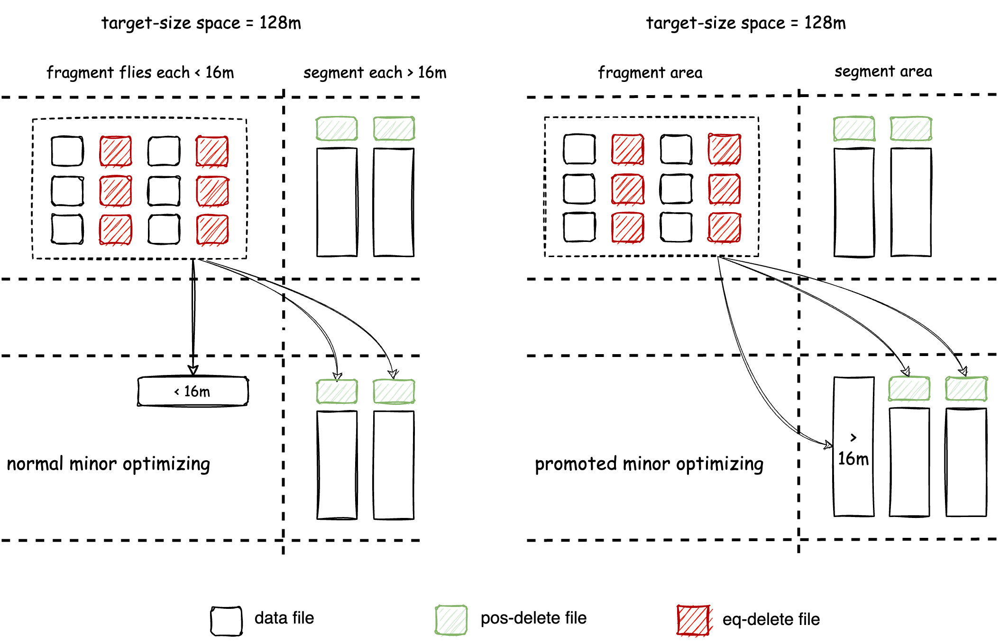
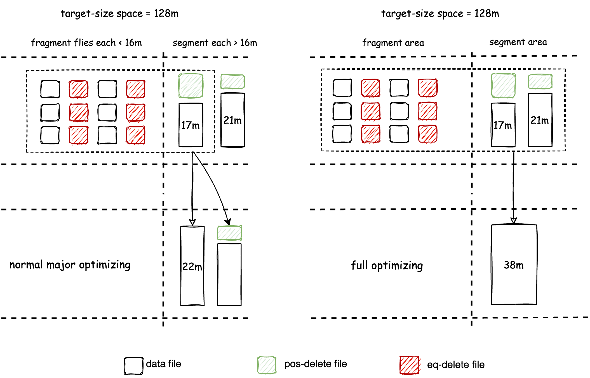

## Introduction

LakeHouse 具有开放和低耦合的特性，数据和文件交给用户通过各类引擎维护，这样的架构在 T+1 的场景下看起来还好，但随着越来越多的人关注如何将 Lakehouse 应用于流式数仓，实时分析场景，问题变得难以调和，比如：

- 流式写入带来海量的小文件
- CDC ingestion 和流式更新产生过量的 delta 数据
- 应用新型数据湖格式会带来孤儿文件和过期快照

上述任何问题都会给数据分析的性能和成本带来严重影响，为此 Arctic 引入 self-optimizing 机制，目标是将基于新型 table format 打造像数据库，传统数仓一样开箱即用的流式湖仓服务，Self-optimizing 包含但不限于文件合并，去重，排序，孤儿文件和过期快照的清理。

Self-optimizing 的架构与工作机制如下图所示：

{:height="80%" width="80%"}

Optimizer 是 self-optimizing 的执行组件，是由 AMS 管理的常驻进程，AMS 会负责发现和计划湖仓表的自优化任务，并实时调度给 optimizer 分布式执行，最后由 AMS 负责提交优化结果，Arctic 通过 Optimizer Group 对 Optimizers 实现物理隔离。

Arctic 的 self-optimizing 的核心特性有：

- 自动、异步与透明 — 后台持续检测文件变化，异步分布式执行优化任务，对用户透明无感
- 资源隔离和共享 —允许资源在表级隔离和共享，以及设置资源配额
- 灵活可扩展的部署方式 — 执行节点支持多种部署方式，便捷的扩缩容

## Self-optimizing mechanism

在数据写入过程中，可能会产生写放大和读放大两类情况：

- 读放大 — 由于写入过程中产生过量的小文件，或 delete 文件与 insert 文件产生了过多的映射（如果你是 Iceberg v2 format 用户，对这个问题可能不陌生），如果 optimizing 的调度频率跟不上小文件产生的速度，会严重拖慢文件读取性能
- 写放大 — 频繁地调度 optimizing 会让存量数据被频繁合并和重写，造成 CPU/IO/Memoery 的资源竞争和浪费，拖慢 optimizing 的速度，也会进一步引发读放大

为了缓解读放大需要频繁执行 optimizing，但是频繁 optimizing 会导致写放大，Self-optimizing 的设计需要在读放大和写放大之间提供最佳的 trade off，Arctic 的 self-optimizing 借鉴了 java 虚拟机分代垃圾回收算法，将文件按照大小分为 Fragment 和 Segment，将 Fragment 和 Segement 上执行的不同 self-optimizing 过程分为 minor 和 major 两种类型，为此 Arctic v0.4 引入了两个参数来定义 Fragment 和 Segment：

```SQL
-- self-optimizing 的文件目标大小
self-optimizing.target-size = 128;
-- self-optimizing 处理的 fragment 文件阈值
self-optimizing.fragment-ratio = 8
```

self-optimizing.target-size 定义了 major optimizing 的目标输出大小，默认 128m，self-optimizing.fragment-ratio 定义了 fragment 文件阈值在 target-size 中的占比，8 代表着 target-size 的 1/8，对应 128m 的 target-size 默认 fragement 阈值为 16m，小于 16m 是 fragment 文件，大于 16m 是 segment 文件，如下图所示：

{:height="80%" width="80%"}

Minor optimizing 的目标是缓解读放大问题，这里涉及两项工作：

* 将 fragment 文件尽可能快地合并为 segment 文件，当小文件积累时， minor optimizing 会较为频繁地执行
* 将写友好（WriteStore）的文件格式转换为读友好（ReadStore）的文件格式，对 Mixed format 而言是 ChangeStore 向 BaseStore 的转换，对 Iceberg format 则是 eq-delete 文件向 pos-delete 的转换

在 Minor optimizing 执行多次之后，表空间内会存在较多的 Segment 文件，虽然 Segement 文件的读取效率很多情况下能够满足对性能的要求，但是：

* 各个 Segment 文件上可能积累了总量可观的 delete 数据
* Segment 之间可能存在很多在主键上的重复数据

这时候影响读取性能不再是小文件和文件格式引发的读放大问题，而是在存在过量垃圾数据，需要在 merge-on-read 时被合并处理，所以 Arctic 在这里引入了 major optimizing 通过 segment 文件合并来清理垃圾数据，从而将垃圾数据量控制在一个对读友好的比例，一般情况下，minor optimizing 已经做过多轮去重，major optimizing 不会频繁调度执行，从而避免了写放大问题。另外，Full optimizing 会将 target space 内所有文件合并成一个文件，是 major optimizing 的一种特殊情况：

{:height="80%" width="80%"}

Major optimizing 和 minor optimizing 的设计参考了垃圾回收算法的分代设计，两种 optimizing 的执行逻辑是一致的，都会执行文件合并，数据去重，WriteStore 格式向 ReadStore 格式的转换，Minor、major 和 full optimizing 的输入输出关系如下表所示：

| Self-optimizing type  | Input space  | Output space  | Input file types  | Output file types  |
|:----------|:----------|:----------|:----------|:----------|
| minor    | fragment    | fragment/segment    | insert, eq-delete, pos-delete   | insert, pos-delete    |
| major    | fragment, segment    | segment    | insert, eq-delete, pos-delete    | insert, pos-delete    |
| full    | fragment, segment    | segment    | insert, eq-delete, pos-delete   | insert    |


## Self-optimizing scheduling policy
scheduling policy 表示 AMS 在分发任务给 optimizer 时候的策略，可以决定本次调度哪些表的任务给 optimizer 执行。
不同 optimizer group 可以配置不同的 scheduling policy 以满足不同的优化需求，见 [Optimizer Group 配置](../guides/managing-optimizers.md#optimizer-group)。
用户也可以通过表上的下列配置来关闭 self-optimizing 功能，这样该表就不会被调度执行：

```SQL
self-optimizing.enabled = false;
```
如果你使用的是不可更新的表，如日志，传感器数据，并且已经习惯于 Iceberg 提供的 optimize 指令，可以关闭 self-optimizing 功能。
如果表配置了主键，支持 CDC 摄取和流式更新，比如数据库同步表，或者按照维度聚合过的表，建议开启 self-optimizing 功能。

目前主要提供两种 scheduling policy 分别是 quota 和 balanced。
### quota
quota 是一种按资源使用量调度的策略，单张表的 self-optimizing 资源用量通过在表上配置 quota 参数来管理：

```SQL
-- self-optimizing 能够使用的最大 CPU 数量，可以取小数
self-optimizing.quota = 1;
```

Quota 定义了单张表可以使用的最大 CPU 用量，但 self-optimizing 实际是分布式执行，真实的资源用量是按实际执行时间动态管理的过程，在 optimizing 管理界面，
可以通过 quota occupy 这个指标查看单张表的动态 quota 占用，从设计目标看，quota occupy 指标应当动态趋于 100%。 

在平台中可能出现超售和超买两种情况：

- 超买 — 若所有 optimizer 配置超过所有表配置的 quota 总和，quota occupy 可能动态趋于 100% 以上
- 超卖 — 若所有 optimizer 配置低于所有配置表的 quota 总和，quota occupy 应当动态趋于 100% 以下
### balanced
balanced 是一种按照时间进度调度的策略，越久没有做 self-optimizing 的表在调度的时候具有越高的调度优先级，此策略会尽量使得每张表的 self-optimizing 进度处于相同水平。
这样可以避免在 quota 调度策略场景下，资源消耗大的表长时间不做 self-optimizing 从而影响整体查询效率。
如果一个 optimizer group 内的表对资源使用量没有特别要求，并且希望所有表都有一个不错的查询效率，那么 balanced 策略是一个很好的选择。
